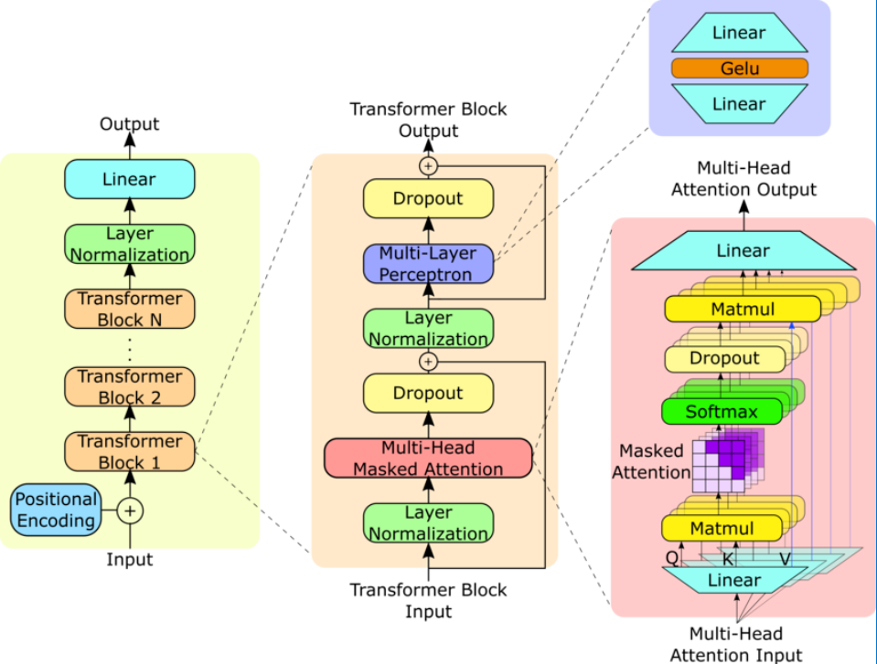

# GPT-2: From Scratch, Pre-trained Loading & Instruction Fine-Tuning

A minimal yet effective implementation of GPT-2 in PyTorch. This project loads pretrained GPT-2 weights and enables text generation while providing insights into the model’s underlying architecture.
It includes fine-tuning capabilities on the Stanford Alpaca dataset for instruction following.

  
*Source: [ResearchGate](https://www.researchgate.net/figure/GPT-2-model-architecture-The-GPT-2-model-contains-N-Transformer-decoder-blocks-as-shown_fig1_373352176)*

## File Info
### Base Model
- `base_model/model.py`: Core GPT-2 model implementation
- `base_model/MHA.py`: Multi-head attention with flash attention for speed
- `base_model/TransformerBlock.py`: Transformer block implementation with pre-layernorm
- `base_model/config.py`: Configuration settings matching gpt2-small (12 layers, 768 dim, 12 heads)
- `base_model/load_weights.py`: Maps Hugging Face GPT-2 weights to this implementation
- `base_model/utils.py`: Helper functions for tokenization and text generation
- `base_model/test.py`: Test the model with different prompts

### Fine-tuning
- `fine_tune/dataset.py`: Dataset loading and processing for Stanford Alpaca
- `fine_tune/train.py`: Training loop and evaluation functions
- `fine_tune/utils.py`: Formatting functions for instruction data and visualization tools
- `fine_tune/config.py`: Training configuration with hyperparameters and dataset settings

## TL;DR
### Base Model
The project implements the complete GPT-2 architecture from scratch:

1. Loads official Hugging Face GPT-2 weights via a precise mapping process
2. Uses tiktoken for efficient tokenization compatible with GPT models
3. Includes full transformer implementation with multi-head attention
4. Generates text with temperature and top-k sampling capabilities

## Fine-tuning on Instructions
The fine-tuning implementation includes:

1. Automatic downloading and preprocessing of the Stanford Alpaca dataset
2. Custom formatting of inputs as instruction-following examples
3. A complete training pipeline with:
- Gradient accumulation for larger effective batch sizes
- Validation evaluation during training
- Learning rate scheduling
- WandB integration for experiment tracking
- Sample generation during training to monitor progress
4. Text generation based on from the fine-tuned model

## Setup

1. Clone the repo:
```bash
git clone https://github.com/aashu-0/FineTuning_GPT2.git
```

2. Create and activate a virtual environment:
```bash
python -m venv venv
source venv/bin/activate
```

3. Install the dependencies:
```bash
pip install -r requirements.txt
```

## Usage
### Base Model with Pre-trained Weights

```bash
# quick test with pretrained weights and different prompts
python -m base_model.test
```
This will run the model with several test prompts using different temperatures and sampling methods.

## Fine-tuning on Alpaca Dataset

```bash
# Download and prepare the dataset
python -m fine_tune.dataset

# Fine-tune the model
python fine_tune/train
```
The training script will:

1. Download the Alpaca dataset
2. Create a manageable subset for faster experimentation
3. Format the data for instruction following
4. Fine-tune the model for 1 epoch while tracking progress with WandB
5. Generate sample responses during training to show improvement
6. Save the final model weights


## Custom

### Base Model
try your own prompts by modifying `base_model/test.py` or importing the model directly:

```python
from base_model.load_weights import load_gpt2_weights_to_model
from base_model.utils import text_to_token_ids, token_ids_to_text, generate
from base_model.config import GPT2Config
import tiktoken

config = GPT2Config()
model = load_gpt2_weights_to_model(config)
tokenizer = tiktoken.get_encoding('gpt2')

output_ids = generate(
    model=model,
    idx=text_to_token_ids("your prompt here", tokenizer),
    max_new_tokens=30,
    context_size=config.context_length,
    temp=0.7,
    top_k=40
)

print(token_ids_to_text(output_ids, tokenizer))
```

### Fine-Tuned Model Usage
```python
import torch
from base_model.model import GPTModel
from base_model.config import GPT2Config
from base_model.utils import text_to_token_ids, token_ids_to_text, generate
import tiktoken

# Load your fine-tuned model
config = GPT2Config()
model = GPTModel(config)
model.load_state_dict(torch.load("gpt2_finetuned.pt"))
tokenizer = tiktoken.get_encoding('gpt2')

# Format prompt using Alpaca-style instruction format
prompt = """Below is an instruction that describes a task. Write a response that appropriately completes the request.

### Instruction:
Explain quantum computing in simple terms.

### Response:
"""

# Generate response
output_ids = generate(
    model=model,
    idx=text_to_token_ids(prompt, tokenizer),
    max_new_tokens=150,
    context_size=config.context_length,
    temp=0.7,
    top_k=40
)

print(token_ids_to_text(output_ids, tokenizer))
```

## soon
- [x]instruction fine-tuning gpt2 on Stanford alpaca dataset
- [ ]implementing lora for efficient training
- [ ]evaluating fine-tuned model
- [ ]explore various optimization techniques
- [ ]model quantization for faster inference

## acknowledgments and references

- [Hugging Face's GPT-2 Implementation](https://huggingface.co/gpt2)
- [Build a Large Language Model (From Scratch) Book](https://github.com/rasbt/LLMs-from-scratch)
- [Andrej Karpathy’s Let's reproduce GPT-2 ](https://youtu.be/l8pRSuU81PU?si=vELvndsmquwRzyB9)