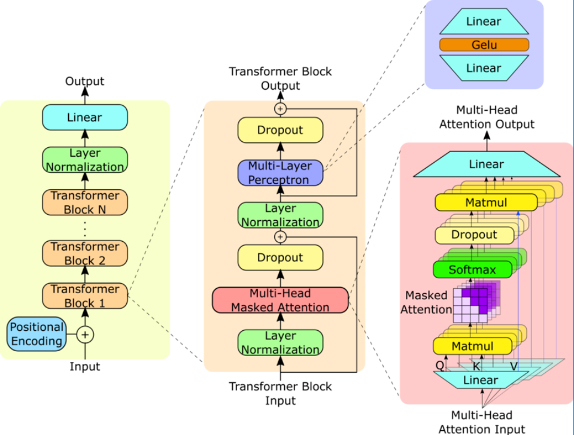

# GPT-2: From Scratch & Fine-Tuning on Alpaca

A minimal yet effective implementation of GPT-2 in PyTorch. This project loads pretrained GPT-2 weights and enables text generation while providing insights into the model’s underlying architecture.
Add finetune soon!

  
*Source: [ResearchGate](https://www.researchgate.net/figure/GPT-2-model-architecture-The-GPT-2-model-contains-N-Transformer-decoder-blocks-as-shown_fig1_373352176)*


## Files

- `model.py`: core gpt2 model implementation
- `MHA.py`: multi-head attention with flash attention for speed
- `TransformerBlock.py`: transformer block implementation with pre-layernorm
- `config.py`: configuration settings matching gpt2-small (12 layers, 768 dim, 12 heads)
- `load_weights.py`: maps huggingface gpt2 weights to this implementation
- `utils.py`: helper functions for tokenization and text generation
- `test.py`: test the model with different prompts

## setup

```bash
# create venv
python -m venv aienv
source aienv/bin/activate  # or .\aienv\Scripts\activate on windows

# install deps
pip install -r requirements.txt
```

## run it

```bash
# quick test with pretrained weights
python test.py
```

## how it works

1. loads official huggingface gpt2 weights
2. maps them to our custom implementation 
3. uses tiktoken for tokenization
4. generates text with temperature and top-k sampling

## examples

try your own prompts by modifying `test.py` or importing the model directly:

```python
from load_weights import load_gpt2_weights_to_model
from utils import text_to_token_ids, token_ids_to_text, generate
from config import GPT2Config
import tiktoken

config = GPT2Config()
model = load_gpt2_weights_to_model(config)
tokenizer = tiktoken.get_encoding('gpt2')

output_ids = generate(
    model=model,
    idx=text_to_token_ids("your prompt here", tokenizer),
    max_new_tokens=30,
    context_size=config.context_length,
    temp=0.7,
    top_k=40
)

print(token_ids_to_text(output_ids, tokenizer))
```

## soon
- instruction fine-tuning gpt2 on Stanford alpaca dataset
- implementing lora for efficient training
- explore various optimization techniques. 

## acknowledgments and references

- [Hugging Face's GPT-2 Implementation](https://huggingface.co/gpt2)
- [Build a Large Language Model (From Scratch) Book](https://github.com/rasbt/LLMs-from-scratch)
- [Andrej Karpathy’s Let's reproduce GPT-2 ](https://youtu.be/l8pRSuU81PU?si=vELvndsmquwRzyB9)
